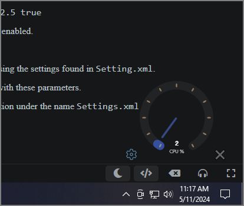
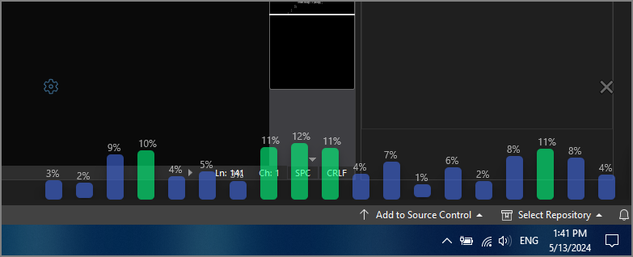

# 💻 WinUI3 - Tranparency

* Demonstration of transparent [WinUI3](https://learn.microsoft.com/en-us/windows/apps/winui/winui3) [Window](https://learn.microsoft.com/en-us/windows/windows-app-sdk/api/winrt/microsoft.ui.xaml.window?view=windows-app-sdk-1.5) widget.
* This feature is trivial when using the [AllowsTransparency](https://learn.microsoft.com/en-us/dotnet/api/system.windows.window.allowstransparency?view=windowsdesktop-8.0#remarks) property in WPF; but since the WinUI3 Window is meant for x-plat purposes we do not have that luxury. 
* Other [Nuget](https://learn.microsoft.com/en-us/nuget/what-is-nuget) packages include:
	- "CommunityToolkit.Mvvm" Version="8.2.2"
	- "CommunityToolkit.WinUI" Version="7.1.2"
	- "Microsoft.Extensions.DependencyInjection" Version="8.0.0"
	- "Microsoft.Windows.CsWin32" Version="0.3.2-beta"
	- "Microsoft.Windows.CsWinRT" Version="2.0.2"
	- "Microsoft.WindowsAppSDK" Version="1.5.240428000" />
	- "Microsoft.Windows.SDK.BuildTools" Version="10.0.22621.3233"
	- "Microsoft.Xaml.Behaviors.WinUI.Managed" Version="2.0.9"
	- "System.Diagnostics.PerformanceCounter" Version="8.0.0"

## 🎛️ Usage
* This application was intented to be run unpakaged, but I have added checks for running in packaged format as well.
* Upon first run the `TransparencyConfig.json` settings file will be created. During runtime, these settings can be adjusted from the `ConfigWindow.xaml`

## 🧾 License/Warranty
* Permission is hereby granted, free of charge, to any person obtaining a copy of this software and associated documentation files (the "Software"), to deal in the Software without restriction, including without limitation the rights to use, copy, modify, merge, publish and distribute copies of the Software, and to permit persons to whom the Software is furnished to do so, subject to the following conditions: The above copyright notice and this permission notice shall be included in all copies or substantial portions of the Software.
* The software is provided "as is", without warranty of any kind, express or implied, including but not limited to the warranties of merchantability, fitness for a particular purpose and noninfringement. In no event shall the author or copyright holder be liable for any claim, damages or other liability, whether in an action of contract, tort or otherwise, arising from, out of or in connection with the software or the use or other dealings in the software.
* Copyright © 2023-2024. All rights reserved.

## 📋 Proofing
* This application was compiled and tested using *VisualStudio* 2022 on *Windows 10* versions **22H2**, **21H2** and **21H1**.

